# SMS Spam Classification

## Overview
This project focuses on classifying SMS messages as spam or not spam using machine learning techniques. The dataset has been cleaned, preprocessed, tokenized, vectorized, and modeled to provide accurate predictions. The final model is deployed using Streamlit for easy user interaction.

## Features
- **Data Cleaning**: Handling missing values, renaming columns, and removing duplicates.
- **Exploratory Data Analysis (EDA)**: Analyzing class distribution, text length statistics, and visualizing patterns.
- **Text Preprocessing**: Tokenization, stopword removal, stemming, and special character removal.
- **Feature Engineering**: Extracting features using TF-IDF and CountVectorizer.
- **Machine Learning Models**: Training multiple classifiers including Naïve Bayes, SVM, Decision Trees, Random Forest, and XGBoost.
- **Model Evaluation**: Assessing accuracy, precision, recall, and confusion matrices.
- **Streamlit Web App**: A simple UI for users to input text messages and get predictions.

## Technologies Used
- **Python** (Pandas, NumPy, Scikit-learn, NLTK, Matplotlib, Seaborn, XGBoost)
- **Jupyter Notebook**
- **Streamlit**
- **Git & GitHub**

## Data Processing
1. **Data Cleaning**:
   - Removed unnecessary columns.
   - Renamed columns for better readability.
   - Dropped duplicate entries to ensure data integrity.
   - Handled missing values appropriately.

2. **Exploratory Data Analysis (EDA)**:
   - **Spam vs Ham Distribution**
     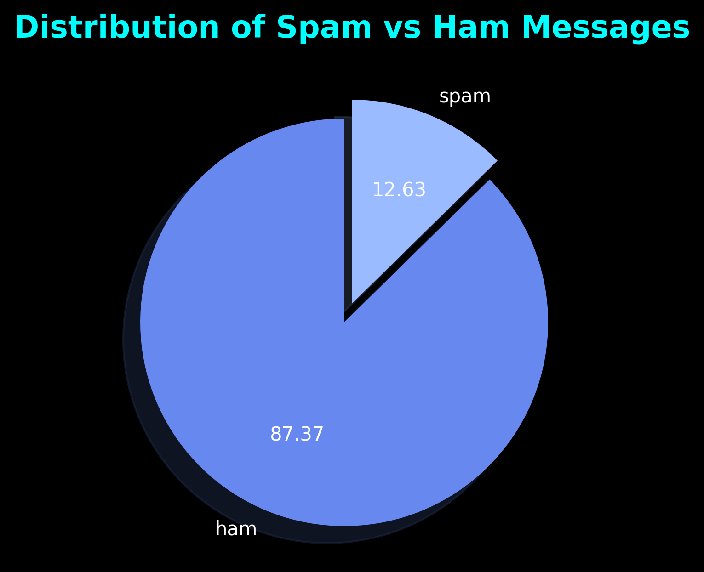
   - **SMS Length Distribution**
     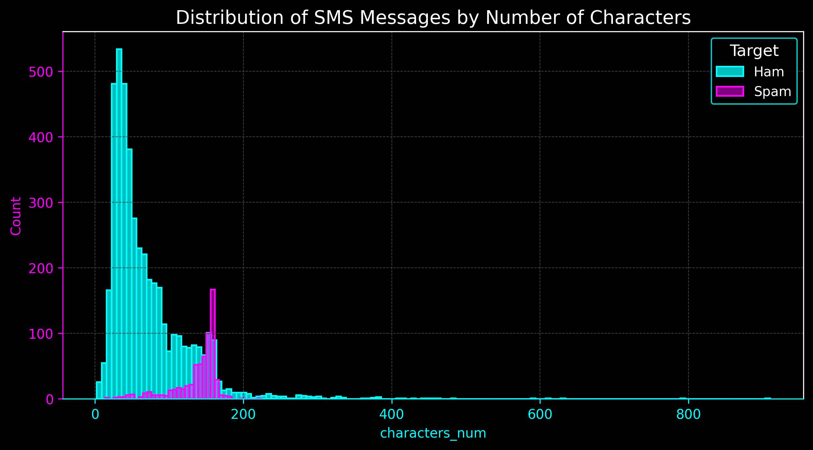
   - **SMS Word Count Distribution**
     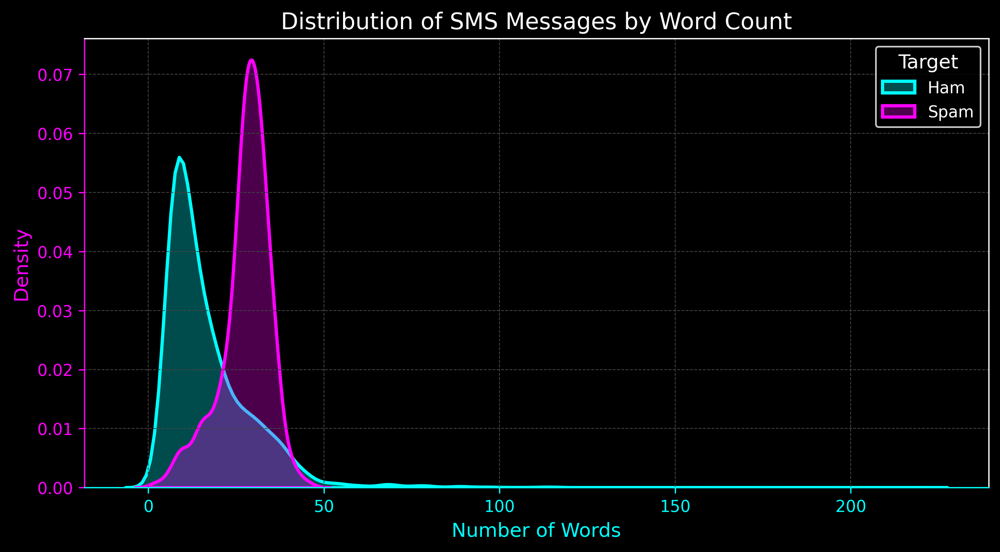
   - **SMS Sentence Count Distribution**
     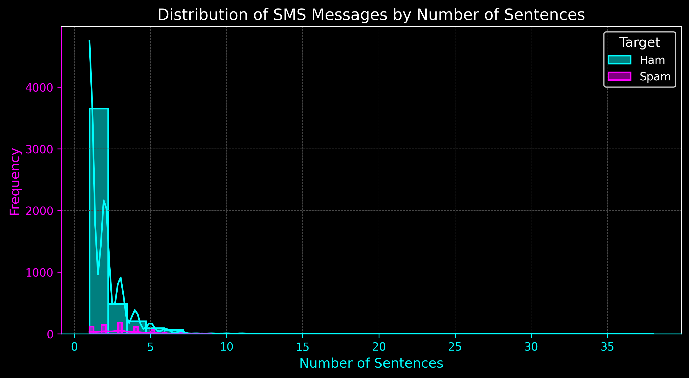

3. **Text Preprocessing**:
   - Converted text to lowercase and tokenized it.
   - Removed stopwords and punctuation.
   - Applied stemming using the Porter Stemmer.
   - Created additional features (character count, word count, sentence count).

4. **Feature Engineering**:
   - Transformed text data into numerical form using TF-IDF vectorization and CountVectorizer.
   - Normalized feature values using MinMaxScaler.

5. **Model Training & Evaluation**:
   - Trained multiple machine learning models (Naïve Bayes, SVM, Decision Trees, Random Forest, XGBoost, etc.).
   - Compared performance using accuracy, precision, recall, and confusion matrices.
   - Implemented ensemble techniques (Voting Classifier, Stacking Classifier) for better performance.

   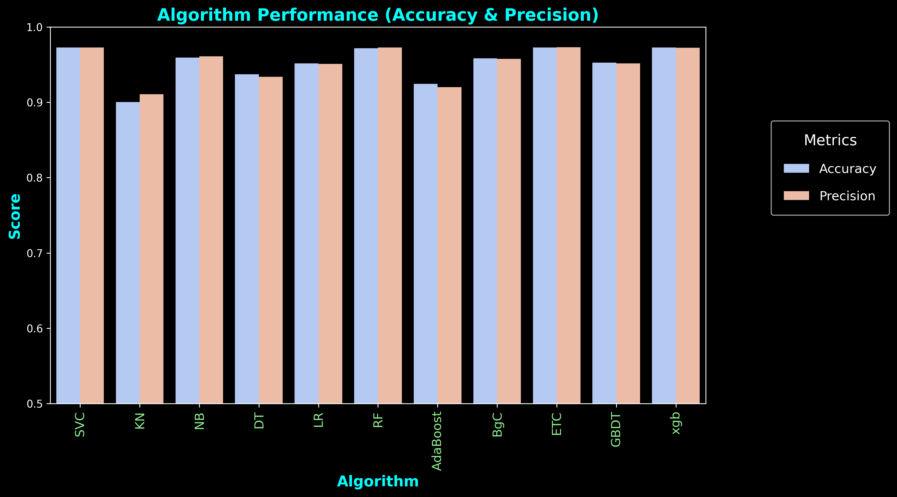

## How to Run
1. Clone the repository:
   ```sh
   git clone git@github.com:MoustafaMohamed01/SMS-Spam-Collection-Dataset.git
   cd SMS-Spam-Collection-Dataset
   ```
2. Install dependencies:

   Ensure you have Python **3.7+** installed. Then, install the         required libraries:  
    ```bash
    pip install -r requirements.txt
    ```

    Alternatively, install manually:  
   ```sh
   pip install numpy pandas seaborn matplotlib scikit-learn nltk streamlit xgboost wordcloud
   ```
3. Run the Streamlit app:
   ```sh
   streamlit run app.py
   ```
4. Enter an SMS message in the text box and click the **Predict** button to see the result.

## Dataset
- The dataset contains labeled SMS messages categorized as `Spam` or `Ham` (Not Spam).
- Includes text message content and corresponding spam/ham labels.
- The dataset was sourced from [Kaggle].
- The dataset link: [https://www.kaggle.com/datasets/uciml/sms-spam-collection-dataset].

## Visualizations & Insights
- **Feature Pairplot by Target**
  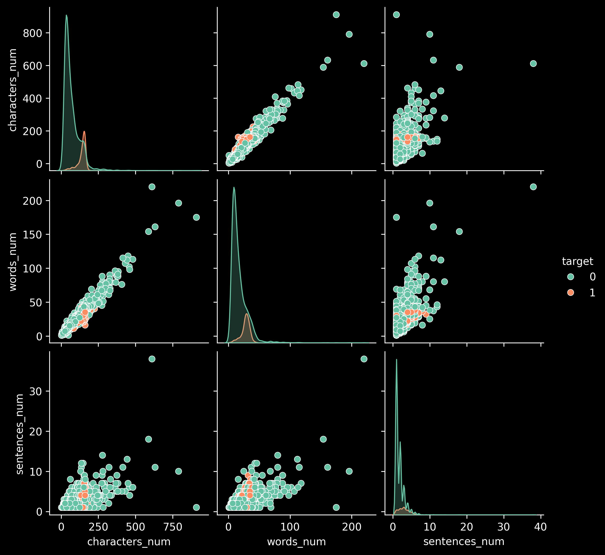
- **Correlation Heatmap**
  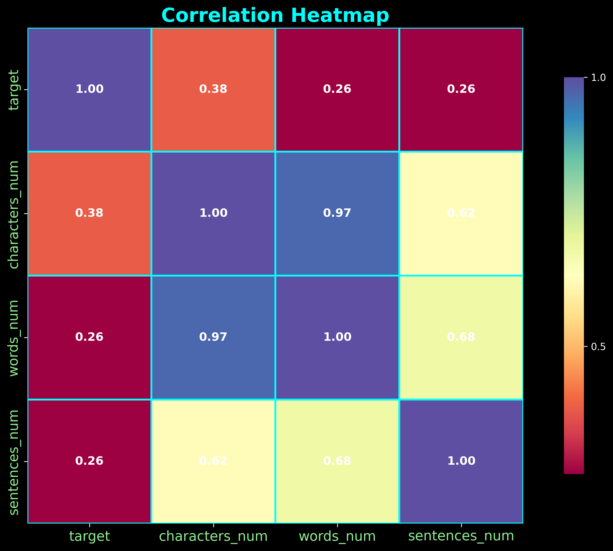
- **Spam Word Cloud**
  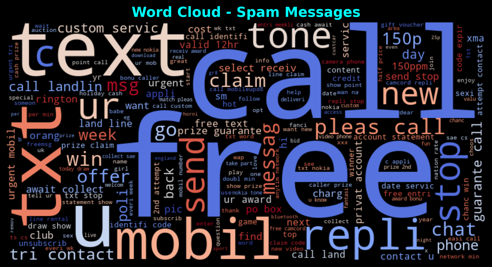
- **Ham Word Cloud**
  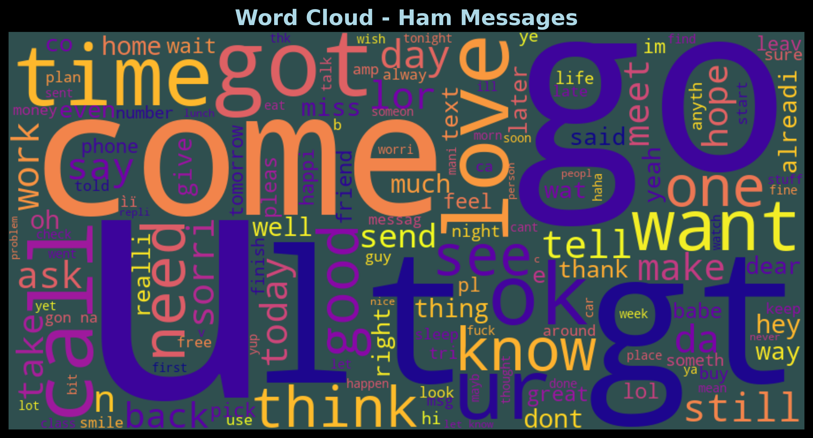
- **Most Popular Words in Spam Corpus**
  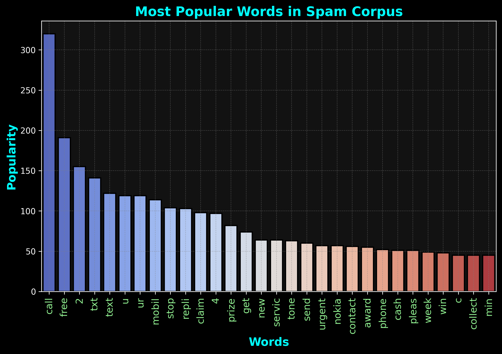
- **Most Popular Words in Ham Corpus**
  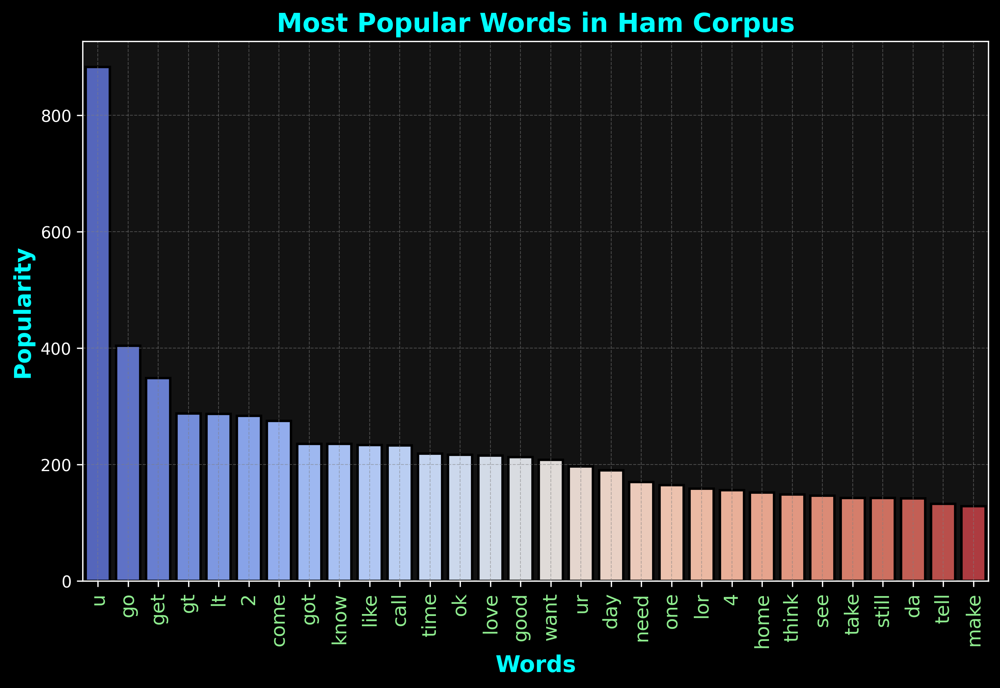

## Streamlit Web App 🖥️
Here’s a preview of the deployed web app:


## Contributing
Contributions are welcome! Feel free to fork the repository, create a branch, and submit a pull request.
